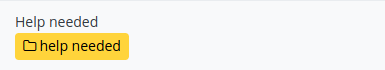

# Kanbana

Kanbana allows you to create boards to track users and projects from flat markdown files that are rendered as Kanban boards.
Based on Crepido by [@issmirnov](https://github.com/issmirnov).


## Table of contents

- [Kanbana](#kanbana)
  - [Table of contents](#table-of-contents)
  - [Features](#features)
  - [Setup](#setup)
    - [Manual setup](#manual-setup)
    - [Docker setup](#docker-setup)
      - [`docker run`](#docker-run)
      - [Docker compose](#docker-compose)
  - [Usage](#usage)
    - [How to create boards](#how-to-create-boards)
    - [Header images](#header-images)
    - [Labels, timers and tasks](#labels-timers-and-tasks)
      - [Custom labels](#custom-labels)
  - [License](#license)

## Features

Kanbana is easy to use! It uses flat Markdown files that every text editor can open

-   Dark and light mode
-   Markdown formatting
-   Links
-   Labels and custom labels
-   Timers
-   Tasks
-   Multiple boards across a same page
-   Inline images
-   Responsive design
-   Integrated caching

See [demo.md](boards/demo.md) or [example.md](boards/example.md) for examples

## Setup

### Manual setup

1. Clone this repository  
   `$ git clone https://github.com/SrGMC/kanbana.git`
2. Navigate to the cloned repo directory  
   `$ cd kanbana`
3. Install dependencies  
   `$ npm install`
4. Start the server  
   `$ npm run`

A server will start at port 3000.  
You can change the port and cache time two ways:

-   CLI Arguments (takes priority)
    -   `-p <port>`
    -   `-c <cache time>` (in minutes).
-   Environment variables
    -   `PORT=<port>`
    -   `CACHE=<cache time>` (in minutes).

### Docker setup

#### `docker run`

```bash
docker run \
-p 3000:3000 \
-v "$PWD/boards:/usr/src/app/boards" \
-v "$PWD/images:/usr/src/app/images" \
-v "$PWD/labels.css:/usr/src/app/assets/labels.css" \
srgmc/kanbana
```

This command will start the container and mount `$PWD/boards` and `$PWD/images` inside it, so you can add images and boards. If you do not want to customize `labels.css`, remove `-v "$PWD/labels.css:/usr/src/app/assets/labels.css"` from the command.

#### Docker compose

```yaml
version: "3"
services:
    kanbana:
        environment:
            PORT: 3000      # Optional
            CACHE: 10       # Optional, in minutes
        image: srgmc/kanbana
        ports:
            - "3000:3000"   # If PORT is changed, this must be changed too
        volumes:
            - "/path/to/boards:/usr/src/app/boards"
            - "/path/to/images:/usr/src/app/images"
            - "/path/to/labels.css:/usr/src/app/assets/labels.css" # Optional
```

## Usage

### How to create boards

1. Create a file in the _./boards_ directory.
2. Add the following content:

```
---
"name": "Kanbana",
"picture": "none"
---

# Headers
* [UI] Labels
* [1h] Timers
* [25m] [UI] Labels and timers
* [ ] Uncompleted task
* [x] Completed task

# Markdown
* **Bold**
* *Italic*
* `code`
```

3. Acess your boards a `http://<server ip>:<port>/board/<board name>` or `http://<server ip>:<port>/board/<board name>.md`

Note:

1. Each heading followed by a list will be converted to a card.
2. You can create more than one board on the same page by duplicating the content above in the same file.

### Header images

Header images can be used in three ways:

1. `none`: Don't display any images
2. `/images/path-to-images.png`: Add images to the `images` directory and fetch them from Kanbana's server
3. `https://example.com/example.png`: Use an URL to fetch an external images


Example:
```html
<!-- No image -->
---
"name": "Kanbana",
"picture": "none"
---

<!-- Internal image -->
---
"name": "Kanbana",
"picture": "/images/image.png"
---

<!-- External image -->
---
"name": "Kanbana",
"picture": "https://example.com/example.png"
---
```

### Labels, timers and tasks

To add labels and timers, use:

```md
<!-- Labels -->
[Title] [labels]

<!-- Timers -->
[2d] 2 days
[3h] 3 hours
[30m] 30 minutes
```

Using tasks is easy too:

```
[ ] Uncompleted task
[x] Completed task
```

#### Custom labels

Labels can be customized using CSS

To create custom labels, edit `assets/labels.css`. A custom label follows this sintax: `.label--<label name>`.

For example, to create a _Help needed_ label with yellow color, create the class:

```css
.label--help-needed {
    background-color: #ffd43b;
    color: #000;
}
```

and use the label

```md
[help needed]
```




## License

The MIT License (MIT)

Copyright (c) 2017 Álvaro Galisteo

Permission is hereby granted, free of charge, to any person obtaining a copy
of this software and associated documentation files (the "Software"), to deal
in the Software without restriction, including without limitation the rights
to use, copy, modify, merge, publish, distribute, sublicense, and/or sell
copies of the Software, and to permit persons to whom the Software is
furnished to do so, subject to the following conditions:

The above copyright notice and this permission notice shall be included in all
copies or substantial portions of the Software.

THE SOFTWARE IS PROVIDED "AS IS", WITHOUT WARRANTY OF ANY KIND, EXPRESS OR
IMPLIED, INCLUDING BUT NOT LIMITED TO THE WARRANTIES OF MERCHANTABILITY,
FITNESS FOR A PARTICULAR PURPOSE AND NONINFRINGEMENT. IN NO EVENT SHALL THE
AUTHORS OR COPYRIGHT HOLDERS BE LIABLE FOR ANY CLAIM, DAMAGES OR OTHER
LIABILITY, WHETHER IN AN ACTION OF CONTRACT, TORT OR OTHERWISE, ARISING FROM,
OUT OF OR IN CONNECTION WITH THE SOFTWARE OR THE USE OR OTHER DEALINGS IN THE
SOFTWARE.
